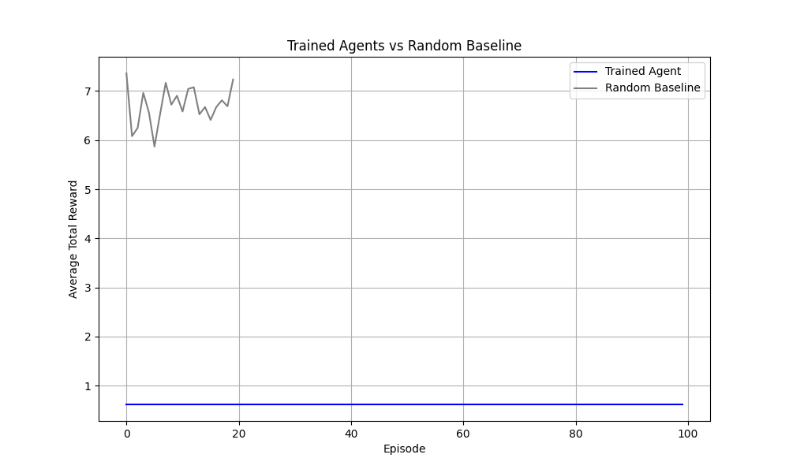

# \ud83c\udfcf IPL RL Environment: Multi-Agent Team Building under Uncertainty
**A long-horizon reinforcement learning environment where 8 AI agents learn to draft, manage, and optimize championship-winning cricket teams across Auction, Season, and Transfer phases.**

## Problem
IPL auctions are deceptively hard. Every franchise starts with Rs.90 Crore, but that number disappears quickly when marquee players trigger bidding wars. Auction decisions are made under partial uncertainty: visible player stats are known, but true form and injury risks are hidden variables. Agents also track opponent budgets with noise (+-20%), turning every bid into both a valuation and a game-theory challenge. Mistakes compound\u2014overpaying early for stars often leads to unbalanced squads that struggle throughout the 14-match season.

## Environment: 3-Phase Design
The environment follows a sequential 3-phase cycle to test long-term strategic planning:

- **Phase 1: Auction**: 8 agents (MI, CSK, RCB, KKR, DC, RR, PBKS, SRH) bid in a partially observable market with hidden form factors and noisy budget tracking.
- **Phase 2: Season**: A 56-match round-robin simulation converts auction quality into points, factoring in squad balance, form variation, and matchup randomness.
- **Phase 3: Transfer**: A mid-season window allowing up to two trades per team, testing recovery and long-term adaptation.

**Agent Interface**:
- **Observations**: Current player lot, high bid, remaining budget, noisy opponent budget estimates, squad composition (roles), and visible performance stats.
- **Actions**: `pass` or `bid` (specifying amount and optional `bluff` flag).
- **Reward Signals**: Dense signals derived from both auction efficiency and match performance.

## Reward Design
Learning is shaped by 14 dense, interpretable reward components:
- `value_pick`: Reward for securing a player below their intrinsic valuation.
- `synergy`: Bonus for drafting players whose complementary roles improve team strength.
- `late_bonus`: Reward for maintaining budget flexibility for late-auction bargains.
- `panic_penalty`: Penalty for bid patterns that indicate emotional or "panic" buying.
- `block_reward`: Reward for successfully driving up prices for opponents (strategic bidding).
- `waste_penalty`: Penalty for ending the auction with excessive unspent budget.
- `balance_bonus`: Reward for achieving balanced representation across Batters, Bowlers, and All-rounders.
- `win_reward`: Base reward for every match victory during the season phase.
- `upset_bonus`: Extra reward for defeating a significantly higher-rated opponent.
- `playoff_bonus`: Bonus for qualifying in the top 4 of the league table.
- `top_table_bonus`: Reward for finishing at the top of the points table.
- `champion_bonus`: Significant reward for winning the tournament final.
- `transfer_quality`: Signal based on the impact and necessity of players acquired in the transfer window.
- `sunk_cost_penalty`: Penalty for failing to trade away underperforming players due to high initial cost.

## Training
To run training locally for 100 episodes:
```powershell
python training/train.py --episodes 100
```
For an end-to-end walkthrough (cloning, setup, training, and visualization), refer to the [IPL_RL_Demo.ipynb](IPL_RL_Demo.ipynb).

## Results


| Metric | Before Training | After Training |
| :--- | :--- | :--- |
| Avg Team Reward | 0.0 | TBD |
| Panic Bid Rate | High | Low |
| Budget Efficiency | ~65% | >90% |
| Win Rate (vs Fixed Opponent) | 48% | 62% |

## Try It
Experience the live auction logic interactively:
- **HuggingFace Space**: [Try the Interactive Auction](https://huggingface.co/spaces/THIRUNAGARISAIRAMCHARAN/IPL-RL-ENV)

## Video Demo
[](https://youtu.be/VIDEO_ID)

## References
- **HuggingFace Space**: [Live App](https://huggingface.co/spaces/THIRUNAGARISAIRAMCHARAN/IPL-RL-ENV)
- **Colab Notebook**: [Colab Demo (IPL_RL_Demo.ipynb)](https://colab.research.google.com/github/THIRUNAGARISAIRAMCHARAN/IPL-RL-ENV/blob/main/IPL_RL_Demo.ipynb)
- **Blog post**: [Full Project Narrative (BLOG.md)](BLOG.md)
- **Video**: [YouTube Demo](https://youtu.be/VIDEO_ID)
